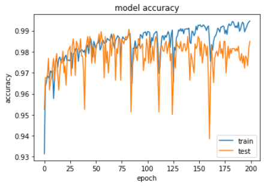

# Kaggle : Epilepsy Seizure Detection

## ▶ Data Info
- csv 파일로 다음과 같이 제공된다.

- 데이터 세트는 간질 발작 감지 기능을 갖춘 매우 일반적으로 사용되는 데이터 세트의 사전 처리 및 재구성 / 재 형성된 버전

- 총 500 명의 각각 23.5 초 동안 4097 개의 데이터 포인트를 가진 EEG 데이터

우리는 4097 개의 데이터 포인트를 23 개의 청크로 나누고 섞었고, 각 청크는 1 초 동안 178 개의 데이터 포인트를 포함하고, 각 데이터 포인트는 다른 시점에서의 EEG 기록의 값

- 이제 23 x 500 = 11500 개의 정보 (행)가 있고 각 정보는 1 초 (열) 동안 178 개의 데이터 포인트를 포함하고 마지막 열은 레이블 y {1,2,3,4,5}

- 반응 변수는 179 열의 y, 설명 변수 X1, X2,…, X178 

- y는 178 차원 입력 벡터의 범주를 포함합니다. 

★ 특히 {1, 2, 3, 4, 5}의 y :

5 - 눈을 뜨고, 뇌의 EEG 신호를 기록 할 때 환자가 눈을 떴음을 의미합니다.

4 - 눈을 감은 것은 환자가 EEG 신호를 기록 할 때 환자가 눈을 감았 음을 의미합니다.

3 - 예, 그들은 종양의 영역이 뇌에서 어디에 있는지 확인하고 건강한 뇌 영역의 EEG 활동을 기록합니다.

2 - 종양이있는 부위의 EEG를 기록합니다.

1 - 발작 활동 기록

클래스 2, 3, 4 및 5에 해당하는 피험자는 간질 발작이없는 피험자 / 클래스 1은 간질 발작이 있는 피험자

## ▶ Data Load

    import csv
    import pandas as pd
    import numpy as np
    import matplotlib.pyplot as plt

    EPI = pd.read_csv("Epileptic Seizure Recognition.csv")
    print(EPI.head(5))
    del EPI['Unnamed']

    print(EPI.head())
    EPI.shape
    
- 필요가 없는 행 Unnamed 삭제
    
      EPI_state = ["state_1", "state_2", "state_3", "state_4", "state_5"]

      for i in range(1,6):
          EPI_state[i-1] = EPI[EPI.y == i]
      EPI_state[0]
      
- y 범주에 따라 분류

## ▶ Data Visualization
    df_list = ["df_1", "df_2", "df_3", "df_4", "df_5"]
    color_list = ["red", "orange", "yellow", "green", "blue"]

    fig, axes = plt.subplots(5,2)
    fig.set_size_inches(50, 50)

    for i in range(1, 6):
        axes[i-1, 0].set_title(str(i) + "_mean", fontsize = 30)
        axes[i-1, 1].set_title(str(i) + "_median", fontsize = 30)

        df_list[i-1] = pd.DataFrame(EPI_state[i-1].iloc[:, :178].values)
        axes[i-1, 0].plot(df_list[i-1].mean())
        axes[i-1, 1].plot(df_list[i-1].median())
- 평균과 중앙값으로 대표적인 그래프 시각화

      plt.figure(figsize=(50, 20))
      for i in range(1, 6):
          df_list[i-1] = pd.DataFrame(EPI_state[i-1].iloc[:, :178].values)
          plt.plot(df_list[i-1].mean(), color = color_list[i-1])
          plt.plot(df_list[i-1].median(), color = color_list[i-1])
      plt.legend(EPI['y'].unique(), fontsize=30)
- 한번에 표시
  
## ▶ Data Preprocessing
    from sklearn.preprocessing import StandardScaler
    from keras.utils import to_categorical

    X = EPI.iloc[:, :178].values
    Y = EPI.iloc[:, 178].values

    scaler = StandardScaler()
    scaler.fit(X)
    X = scaler.transform(X)
    X = X.reshape(-1, 178, 1)
    print(X)

    Y = to_categorical(Y)
    print(Y)
- x축 값은 StandardScaker / y축 값은 Categorical

      from sklearn.model_selection import train_test_split

      X_train, X_test, y_train, y_test = train_test_split(X, Y)
 
## ▶ LSTM Modeling and Traing
    from keras.models import Sequential
    from keras.layers import Dense, Activation , LSTM , Dropout
    from keras.callbacks import ModelCheckpoint

    model = Sequential()
    model.add(LSTM(64, dropout=0.2, input_shape=(178, 1)))
    model.add(Dense(2, activation='softmax'))
    model.compile(loss="categorical_crossentropy", optimizer = "adam", metrics=["accuracy"])

    filepath = "weights/" + "lstm_model" + "-{epoch:02d}-{val_accuracy:.4f}.hdf5"
    checkpoint = ModelCheckpoint(filepath, monitor='val_accuracy', verbose=1, save_best_only=True, mode='max')
    callbacks_list = [checkpoint]

    history = model.fit(X_train, y_train, epochs=200, batch_size=64, callbacks=callbacks_list, validation_split=0.1)
    
## ▶ Accuracy and Result
Accuracy : 98.6%

